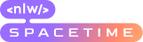

This repo contains the code of **NLW 12** from **Rocketseat**.

> **Note:** my project doesn't contain the mobile part, only the API and the web.

## 🛠 Skills

![nextjs][nextjs] ![tailwindcss][tailwindcss] ![typescript][typescript] ![fastify][fastify]

## 📄 Roadmap

These are the changes I have made during the **NLW 12**:

- [x] Preview for video and images;
- [x] Split routes code into services;
- [x] Create a separated folder for store all the validation schemas using **Zod**;
- [x] Use monorepo and setup `pnpm-workspace.yaml` file;

## 🔗 More About Me

[nextjs]: https://img.shields.io/badge/nextjs-1E4174?style=for-the-badge&logo=next.js&logoColor=white
[tailwindcss]: https://img.shields.io/badge/tailwindcss-1E4174?style=for-the-badge&logo=tailwindcss&logoColor=white
[typescript]: https://img.shields.io/badge/typescript-1E4174?style=for-the-badge&logo=typescript&logoColor=white
[fastify]: https://img.shields.io/badge/fastify-1E4174?style=for-the-badge&logo=fastify&logoColor=white
